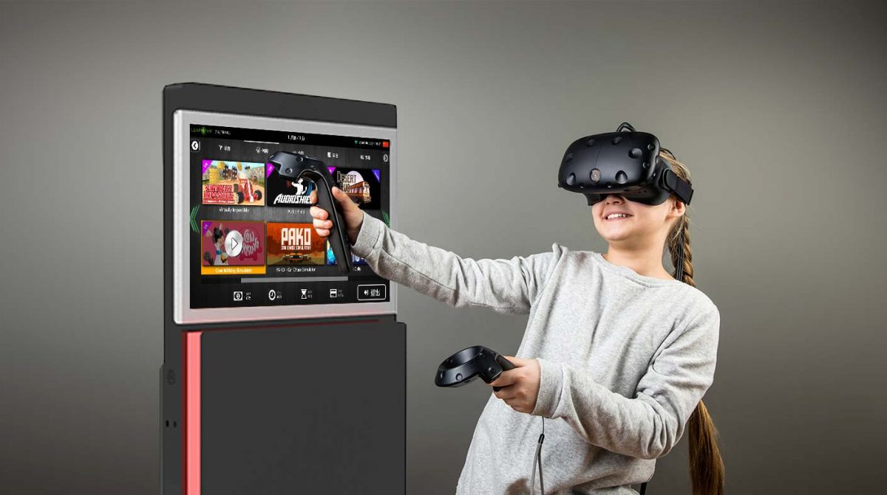
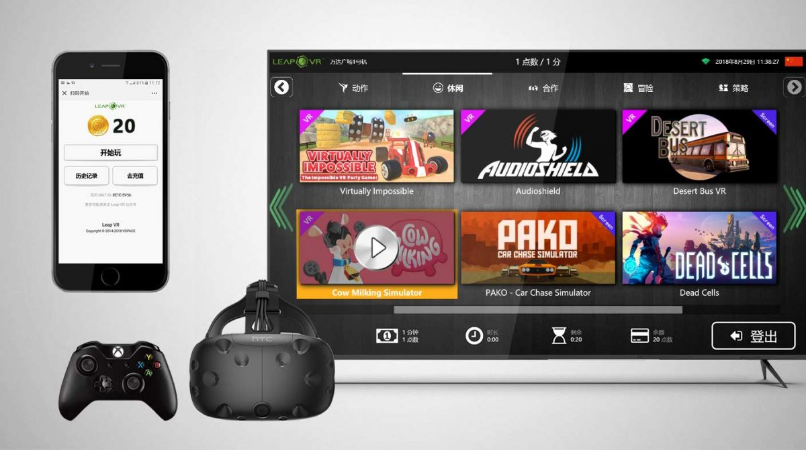
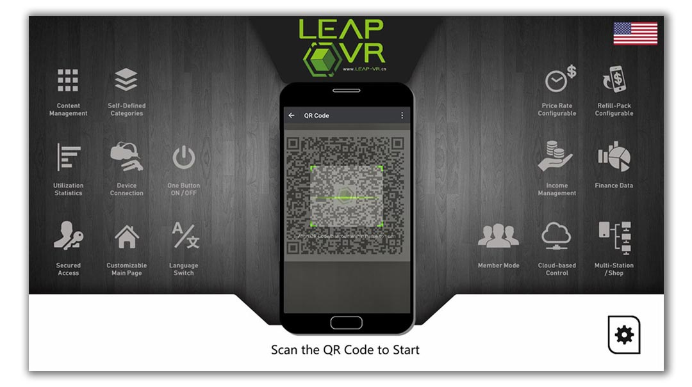
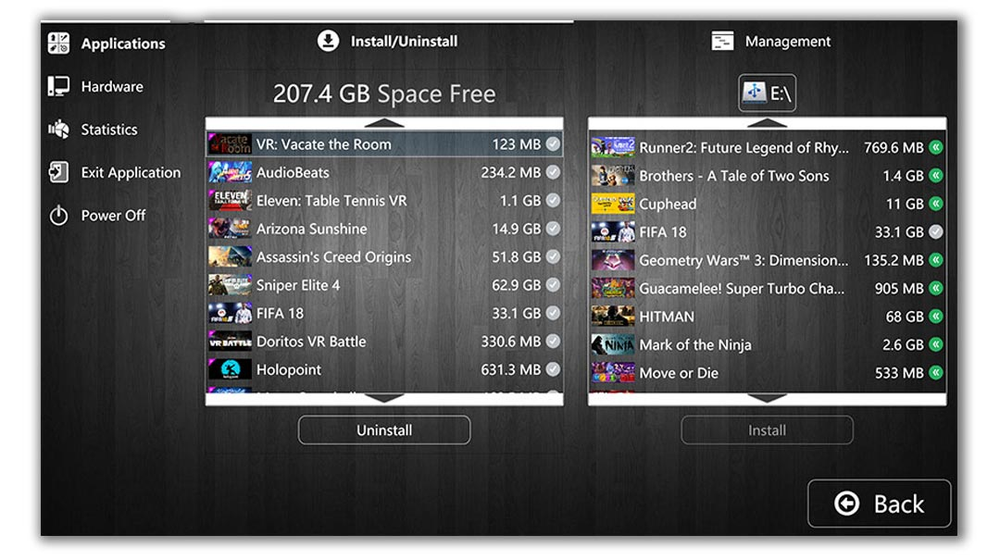
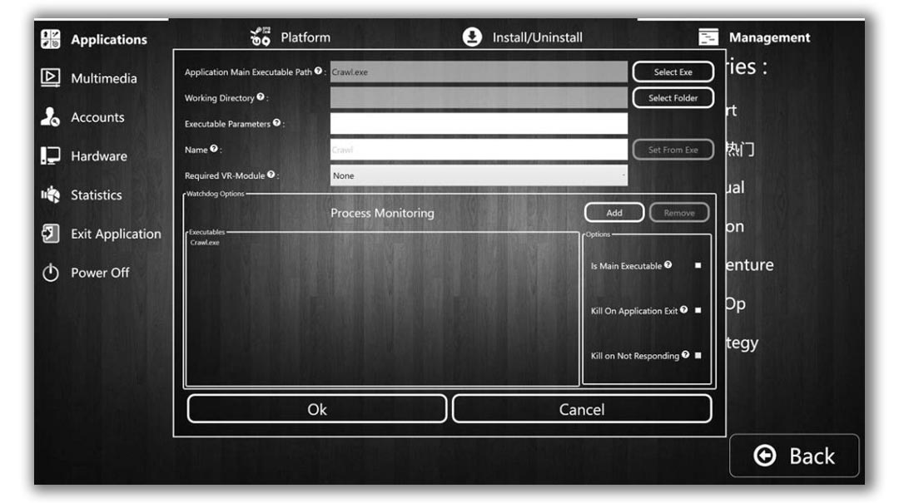
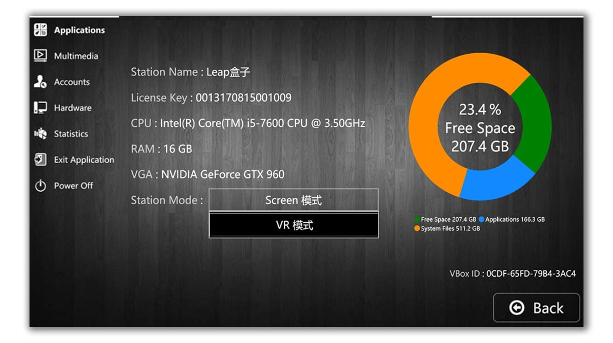
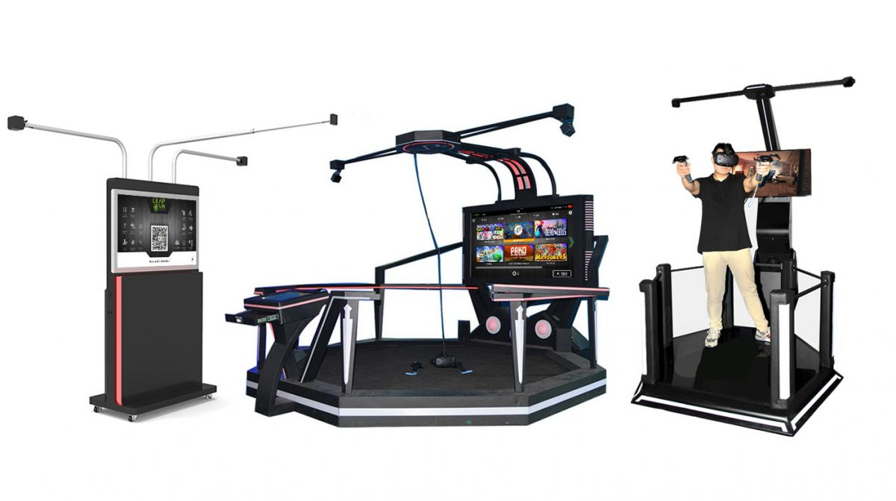

# PlayOnDemand

> **Turn any room into a VR arcade.**

<p align="center">
  
</p>

[](LICENSE)
[](docs/server/)
[](docs/client/)
[](flutter_operator_mobile/)
[](docs/usage/server-deployment.md)
[](docs/open-source-readiness.md)

PlayOnDemand is an open-source, self-hosted **VR-arcade management platform**.
It's the same software stack that shipped commercially as **LeapVR / LeapPlay**
in production VR-arcade venues from ~2018, now released under Apache 2.0 as a
reference implementation operators can build on, extend, and run themselves.

Drop a Windows PC behind a VR headset, pair it with a single Linux server,
and you have a session-billed, operator-managed, multi-station VR arcade —
catalog, login, launch, monitor, restart, all of it.

---

## What you get

- **A Windows kiosk shell** that replaces `explorer.exe`, presents a touch-
  and gamepad-friendly game catalog, launches into SteamVR / OpenVR, and
  watches the game process to know when the session ends.
- **A central server** (ASP.NET Core on .NET 10 LTS) that authenticates
  stations and operators, mints time-bound play sessions, monitors station
  heartbeats over gRPC/TLS, and persists everything in PostgreSQL.
- **An operator UI** (Flutter, web + mobile) for the back-office: see who's
  playing, top up balances, lock and unlock stations, mint API keys, drive
  remote sessions from a phone.
- **A content authoring tool** (`LeapPlay.Content.Creator`) that packages a
  folder of game files plus its launch metadata into a single `.vbox`
  container that any station can install over USB or LAN — including
  partial-edit support so you can fix a title or thumbnail on a 50 GB
  package without re-zipping the whole thing.
- **One-command deployment** via Docker Compose: postgres + server + nginx
  + operator UI in three containers, optional Let's Encrypt TLS.

<p align="center">
  
</p>

---

## Features at a glance

| | |
|---|---|
|  | **Game catalog with category tabs.**<br>Touch-, gamepad-, and VR-pointer-friendly. Per-game artwork, Steam/Screen/VR badges, multi-launch options per app. |
|  | **Multiple station login modes.**<br>Operator-driven (staffed), QR-code self-checkout (mobile-paid), or fully remote (operator drives from the back office). |
|  | **Self-contained game packages.**<br>One `.vbox` file holds the game binaries, the icon, the launch instructions, and the watchdog rules. Install over USB or push from the server. |
|  | **Real launch + process control.**<br>Per-app working dir, args, required VR module, multi-process watchdog with "is main", "kill on exit", "kill on hang" flags. |
|  | **Operator panel on every station.**<br>PIN-protected admin: disk usage, hardware specs, station mode toggle, multimedia background, app library management. |
|  | **Skinnable and localized.**<br>Drop-in skin themes, English + 简体中文 out of the box, custom logo and background music per station. |

---

## Quick start

**Server** — one Linux VM, Docker Compose, ~30 seconds to a working stack:

```sh
git clone https://github.com/<your-org>/PlayOnDemand
cd PlayOnDemand
cp .env.example .env                # set JWT_SECRET, POSTGRES_PASSWORD, ADMIN_*
docker compose up -d                # postgres + server + operator UI
curl http://localhost/health        # -> "Healthy"
```

The operator UI is on `http://localhost:8080/` — log in with the admin
credentials from `.env`, then create a station and mint an API key for it.

**Kiosk** — Windows machine, .NET 10 SDK + .NET Framework 4.7.1 Dev Pack
+ VS 2022 Build Tools + Inno Setup:

```cmd
LeapVR.Shell.Build\Build_Free.bat   :: -> dist\LeapPlayInstaller.exe
LeapPlay.Shell.exe -debug           :: ALWAYS use -debug on dev boxes
```

The setup wizard registers the station against the server with the API key
from the operator UI.

Full deployment, hardening, and troubleshooting are in
[`docs/usage/server-deployment.md`](docs/usage/server-deployment.md) and
[`docs/usage/kiosk-known-issues.md`](docs/usage/kiosk-known-issues.md).

---

## Documentation

| For… | Start here |
|------|-----------|
| **Operators / venue staff** — running a venue, managing stations, taking sessions | [📖 Illustrated manual](docs/manual/) |
| **System integrators** — deploying the server, sizing hardware, configuring TLS | [`docs/usage/server-deployment.md`](docs/usage/server-deployment.md) |
| **Engineers** — extending or porting the code | [`docs/architecture/overview.md`](docs/architecture/overview.md) |
| **Anyone curious** — what this repo is, where it came from, what shipped | [`docs/about.md`](docs/about.md) |

The full doc index is at [`docs/README.md`](docs/README.md).

---

## Hardware

PlayOnDemand was originally shipped with custom VR-arcade cabinets, but it
runs on any Windows 10/11 PC with an SteamVR-compatible HMD (HTC Vive,
Valve Index, Oculus / Meta via SteamVR). The screenshots in this README and
the manual were captured on the original LeapVR cabinets — but every screen
is just a WPF window with no hardware dependency.

<p align="center">
  
</p>

---

## Contributing

Issues and PRs welcome. See [CONTRIBUTING.md](CONTRIBUTING.md) for the
workflow. Security disclosures go via [SECURITY.md](SECURITY.md), not the
public issue tracker.

## License

Apache 2.0 — see [LICENSE](LICENSE). Bundled third-party software is listed
in [THIRD_PARTY_NOTICES.md](THIRD_PARTY_NOTICES.md).
