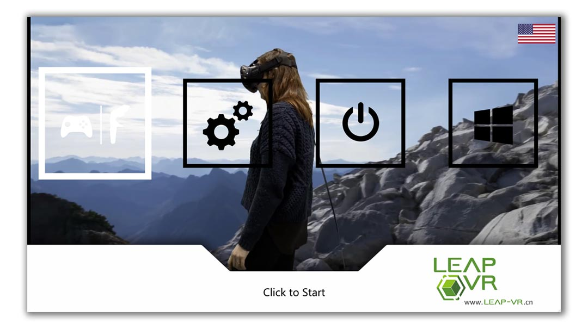
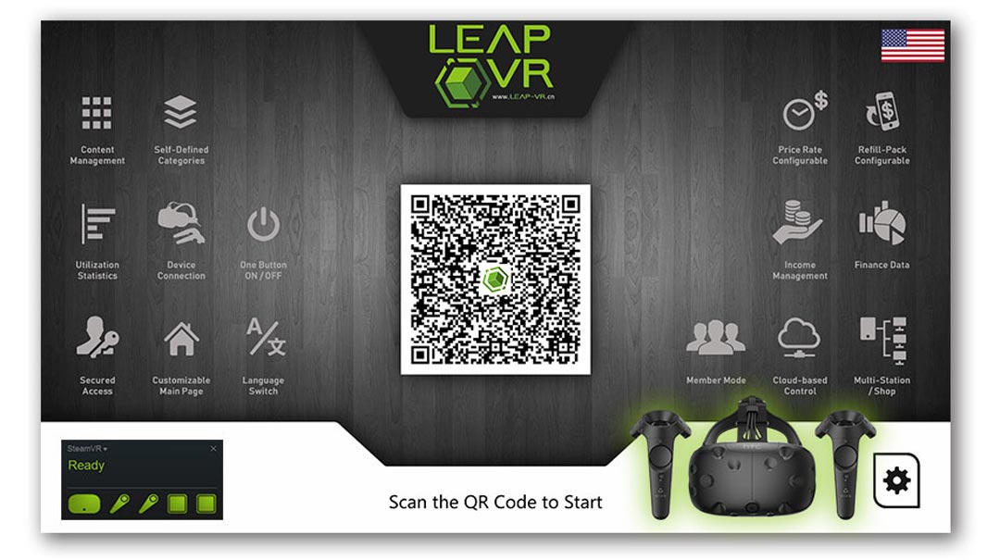
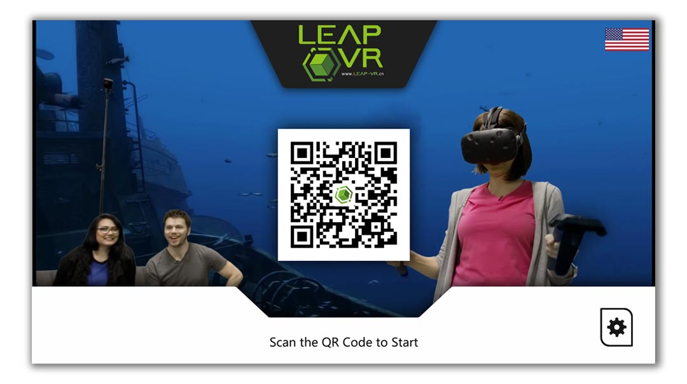
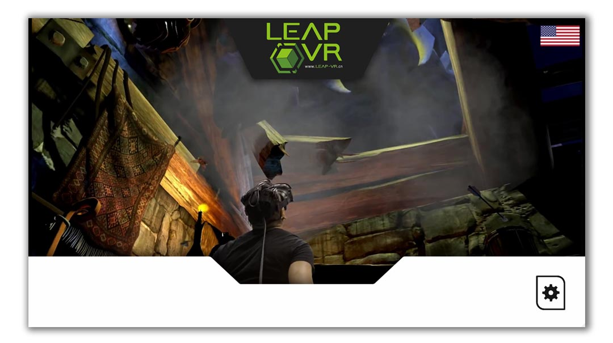
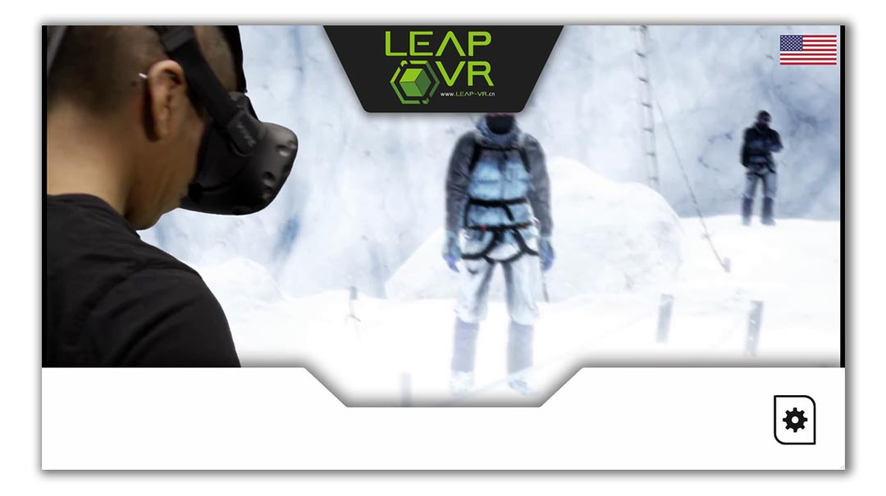

# 02 — Station login modes

> Three ways a player gets to the game catalog, picked per-station by the
> operator. The mode changes the boot-up landing screen and the
> authentication flow; everything *after* login is the same catalog.

The kiosk supports three login flows. Each station is configured with one of
them in the admin panel (see [**Chapter 04**](04-admin-panel.md)). The
underlying session-lifecycle FSM is identical in all three —
see [`../architecture/session-lifecycle.md`](../architecture/session-lifecycle.md)
for the state machine.

---

## Operator-driven mode

Best for staffed venues: an operator at the front desk hands credit to the
station, the player walks up, and the game catalog is already showing.

The four icons across the boot screen are the operator's quick-actions:

- **Game pad / launch** — open the game catalog now (top-up granted by the
  operator).
- **Settings** — station admin.
- **Power** — end the current session.
- **Windows** — drop to the host desktop (debug builds only; production
  builds hide this).

After Click-to-Start, the station moves to the
[**game catalog**](03-game-catalog.md).

---

## QR-code self-checkout mode

Best for unstaffed booths and pay-by-phone venues. The kiosk presents a QR
code; the player scans it with the operator's companion app (or whatever
payment flow you wire up against the REST API), the server mints a session,
and the kiosk unlocks.

The icons around the QR code aren't buttons — they're a quick visual summary
of the platform's feature set, shown while the player is approaching the
machine. The interactive part is the QR code in the middle, and the small
gear icon bottom-right (PIN-protected entry to the
[**admin panel**](04-admin-panel.md)).

When SteamVR / OpenVR has already initialised and is ready, the screen
shows the same QR code plus the VR-ready badge:

The little **SteamVR — Ready** card on the bottom-left is rendered by the
kiosk's `OpenVrModule`. If it's red ("not ready"), the player will see a
helpful prompt to put on the headset before scanning.

### Animated / video background

The QR-login screen can be configured with a background video instead of
the static wood-panel texture — useful for a vendor-themed booth. The
multimedia source list is configured in the admin panel
([**Chapter 04**](04-admin-panel.md) → Multimedia).

---

## Remote / driven-by-operator mode

Best for free-roam VR rooms where the player is already in the headset
across the room and the operator drives session start from a phone or a
back-office screen. The station shows no login surface at all — just the
background content the operator wants. When the operator hits "start" in
the [Flutter operator app](08-operator-app.md), the kiosk transitions
directly into the catalog (or directly into a single specified game, for
preset session templates).

The Settings cog bottom-right is still PIN-protected and goes to the same
[admin panel](04-admin-panel.md). Everything else is operator-controlled
over gRPC. This is the mode used in the original LeapVR free-roam cabinet
designs where the player and the operator are physically separated.

A common variant uses a static "ready for play" graphic instead of a video:

---

## How to pick the mode

| If you have... | Use... |
|----------------|--------|
| Staff at the front, supervised play, time tickets | **Operator-driven** |
| Unstaffed booth, mobile-payment, self-service | **QR-code** |
| Free-roam VR room, supervised remotely, group bookings | **Remote** |

The mode is set per station in
[**Chapter 04 — Admin panel**](04-admin-panel.md) → Station Mode toggle.
It can be changed at any time; no session is lost.

→ [**03 — Game catalog & launch**](03-game-catalog.md)
