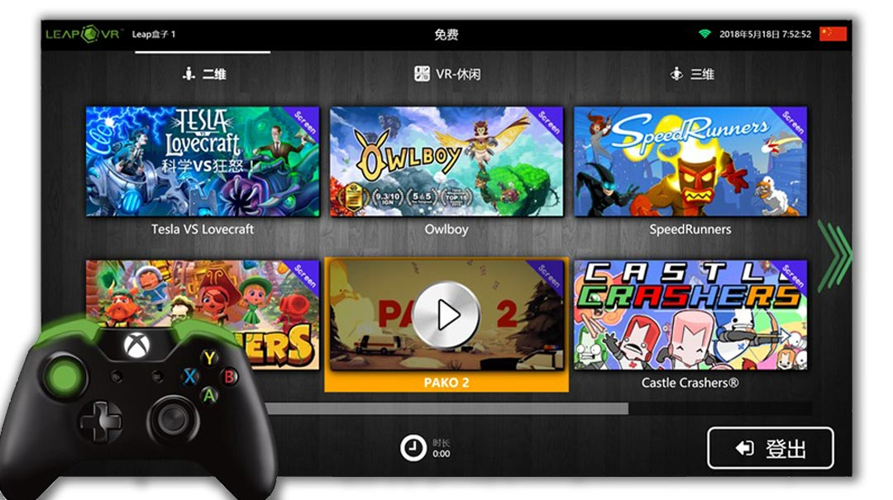
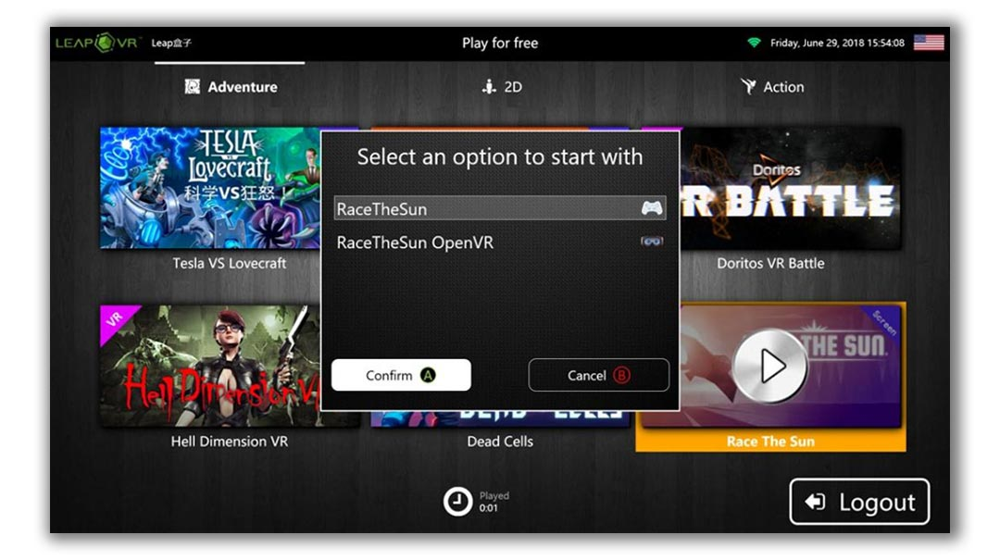

# 03 — Game catalog & launch

> What the player sees after login: a category-tabbed catalog with one
> tile per installed game, a launch-options picker for games that ship in
> multiple flavours, and a footer of session info.

## Anatomy of the catalog

- **Top-left**: the station's brand and station name (here `Leap盒子 1`). The
  station name is set during initial setup against the server.
- **Top centre**: the current session label (here `免费` = free) and
  countdown info.
- **Top right**: connectivity (Wi-Fi indicator) and local time.
- **Tabs**: categories. Categories are configurable per venue; see
  [**Chapter 04 — Admin panel**](04-admin-panel.md). The example here shows
  three: 2D (`二维`), VR-Casual (`VR-休闲`), and 3D (`三维`).
- **Tiles**: one per installed game. Each tile shows the artwork bundled in
  the game's `.vbox` package plus capability badges — **VR**, **Screen**,
  **Steam**, **VR-热门** (featured-VR), …
- **Selected tile**: highlighted with the orange accent and a play overlay.
  The selected tile is moved by gamepad d-pad / VR pointer / touch / arrow
  keys; the platform-agnostic Caliburn.Micro view model normalises all of
  them.
- **Footer**: session clock, remaining balance, logout button.

## Input modalities

Every catalog control responds to the same set of input devices:

- **Touchscreen** — tap tile to select, double-tap or hit the orange play
  overlay to launch.
- **Gamepad** (Xbox / XInput, or any DirectInput pad) — d-pad to navigate,
  A to launch, B to back out, Y / X bound to context actions. The kiosk's
  `XInputModule` watches all four player slots so a gamepad can be picked
  up cold without re-pairing.
- **VR motion controller** — the SteamVR overlay-pointer interaction
  presents an in-VR mirror of this same catalog so the player never has to
  remove the headset to pick a different game. (See the in-VR overlay shot
  in the [main README](../../README.md).)
- **Mouse + keyboard** — primarily for dev / debug; production stations
  hide the cursor.

## Multi-launch games

A single `.vbox` package can declare more than one launch flavour — for
instance, a game that has both a flat-screen and a VR build, or different
content packs. When the player hits launch on a multi-flavour game, the
kiosk shows the picker:

In this example the player is launching **Race The Sun**; the package has
two `ProcessExecutionLogicDto` entries:

| Flavour | Icon | What it does |
|---------|------|--------------|
| `RaceTheSun` | gamepad | flat-screen build, no VR module activated |
| `RaceTheSun OpenVR` | VR | VR build, kiosk activates the OpenVR module first |

The **Required VR Module** field is set per-flavour in the
[**Content Creator**](07-content-creator.md). The kiosk uses that to decide
whether to spin SteamVR up before launching.

## What happens when you click launch

The session-lifecycle FSM is fully documented in
[`../architecture/session-lifecycle.md`](../architecture/session-lifecycle.md);
the short version is:

1. Kiosk asks the server "is this player still allowed?" (heartbeat / quota
   check).
2. Server returns OK + session token.
3. Kiosk activates the required VR module if any (e.g. SteamVR boots if the
   flavour is OpenVR).
4. Kiosk spawns the executable from the `.vbox` with the
   `ExecutionParameters` and `RelativeWorkingDirectory` baked into the
   package.
5. Kiosk attaches a watchdog per `ProcessMonitorInstructionDto` rule —
   "is main executable", "kill on exit", "kill on hang" — and listens for
   the main process to exit.
6. On exit, the kiosk returns to the catalog and reports session end to the
   server.

If the watchdog decides the process is hung
(`KillProcessOnNotResponding`), the kiosk forcibly terminates it and the
station returns to the catalog with the session-end reason flagged for the
operator.

---

→ [**04 — Admin panel**](04-admin-panel.md)
