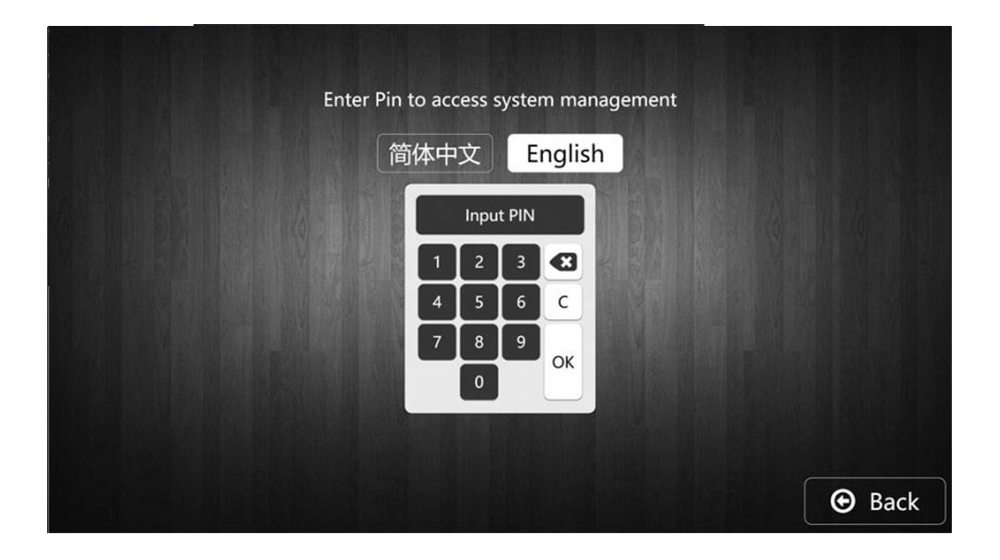
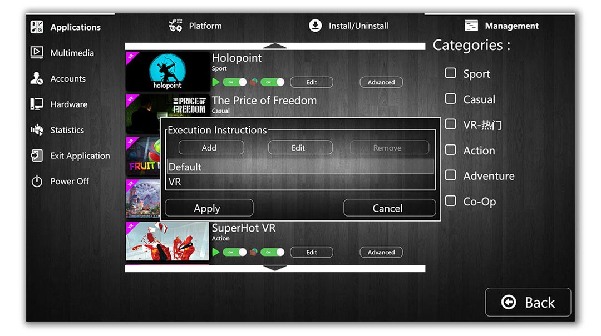

# 04 — Admin panel

> The PIN-protected configuration surface on every kiosk. Station admins
> use this to manage hardware, the installed app library, the multimedia
> background, and the per-game settings.

## Getting in

Tap the small gear icon at the bottom-right of any login screen
([**Chapter 02**](02-station-modes.md)). The kiosk prompts for a PIN:

The PIN is set during initial station setup and stored hashed in the
station's local LiteDB. Changing it is a setting under the admin panel
itself (no server round-trip needed). Five wrong attempts in a row triggers
a 60-second cooldown; ten in a row escalates to a server-recorded incident
on the next heartbeat.

The language toggle changes the UI culture for the admin panel only; the
catalog has its own language toggle.

## Hardware / station info

The first admin tab is read-mostly: it shows what the server sees as this
station's identity and what the local hardware looks like.

- **Station Name** — display label sent to the operator app.
- **License Key** — the station ID issued by the server on first
  registration. This is what the server uses to identify the station in all
  subsequent gRPC calls (along with the password in metadata).
- **CPU / RAM / VGA** — auto-detected via WMI on first launch. Cached, but
  refreshed if the hardware fingerprint changes (operator alert on the
  server side).
- **Station Mode toggle** — Screen / VR. Driving this switch tells the
  kiosk whether to keep SteamVR running between sessions or only spin it
  up on demand for VR-flavour launches. Affects boot time and HMD wear.
- **Disk donut** — three-segment breakdown of the drive selected as the
  `vbox` install root. Apps (cyan) is where `.vbox` packages have been
  extracted; System Files (orange) is everything else; Free Space (green)
  is what's left.
- **VBox ID** — a 16-character per-station hardware-derived identifier
  used to gate package signing in setups that use signed `.vbox` content
  (optional; off by default in v1.0.0).

## Statistics

Both global and per-application metrics, recorded locally and synced to
the server on each heartbeat. Useful for operators deciding which titles
to feature, retire, or licence in bulk.

The "Reset Game Statistics" button at the bottom-right is per-station; the
server's aggregate view across all stations is not affected (and is also
not exposed in this panel — operators use the
[**Flutter operator app**](08-operator-app.md) for cross-station rollups).

## Application management

This is where the catalog tiles come from. The left nav is the same across
the admin panel; the **Applications → Management** tab is the main place an
admin will spend their time:

Per row:
- **Cover** — the artwork shipped in the `.vbox`. Sized for the catalog
  tiles (3:1-ish landscape; see [**Chapter 07**](07-content-creator.md)).
- **Title + Category** — display name and the category that places this
  game on a tab in the catalog.
- **Two toggles** — the green "ON" is "visible in catalog"; the second is
  "available to play" (admins can hide games temporarily without removing
  them from disk).
- **Edit** — change the launch-instruction set for this game (see below).
- **Advanced** — full process-monitoring configuration (see below).

The right column lets the admin re-tag a game into a different category.
Categories themselves are venue-defined; the example shows Sport, VR-热门
(VR Hot), Casual, Action, Adventure, Co-Op, Strategy.

### Edit — launch instructions

For games that ship with multiple launch flavours (flat + VR, base + DLC,
demo + full), the **Edit** button opens the instruction list:

Each entry corresponds to one `ProcessExecutionLogicDto` in the `.vbox`
metadata — the same data model the
[**Content Creator**](07-content-creator.md) writes. Admins can rename,
reorder, or remove flavours after the package is installed, without
re-packaging.

When the player hits launch on a game with more than one flavour, the
catalog shows the multi-launch picker from
[**Chapter 03**](03-game-catalog.md).

### Advanced — process monitoring

This is the surface the kiosk's watchdog reads at runtime. Every running
game has zero or more `ProcessMonitorInstructionDto` rules attached:

The fields:

- **Application Main Executable Path** — the entrypoint relative to the
  game's installed root.
- **Working Directory** — same.
- **Executable Parameters** — extra command-line args appended to launch.
- **Required VR-Module** — if non-empty, the kiosk activates this VR
  runtime before launch (typically `OpenVR`).
- **Watchdog Options → Process Monitoring** — a list of executables to
  watch. Each row has three flags:
  - **Is Main Executable** — when this process exits, the session ends.
    (Many games spawn a launcher that then forks the real game; you want
    the watchdog watching the real game, not the launcher.)
  - **Kill On Application Exit** — when the session ends, force-kill this
    process. Useful for crash handlers / second-instance helpers that
    don't exit on their own.
  - **Kill on Not Responding** — if Windows reports the process as
    not-responding, the kiosk terminates it. Defends against hung games
    locking the station up.

Add rows with **Add**; remove the selected one with **Remove**. **Add**
without a selected row creates a new monitor entry for the application's
own main executable, which is the right thing to do for ~80% of games.

---

→ [**05 — Installing games**](05-installing-games.md) — get a `.vbox` onto
the station. 
→ [**06 — Customization**](06-customization.md) — skins, multimedia,
languages.
