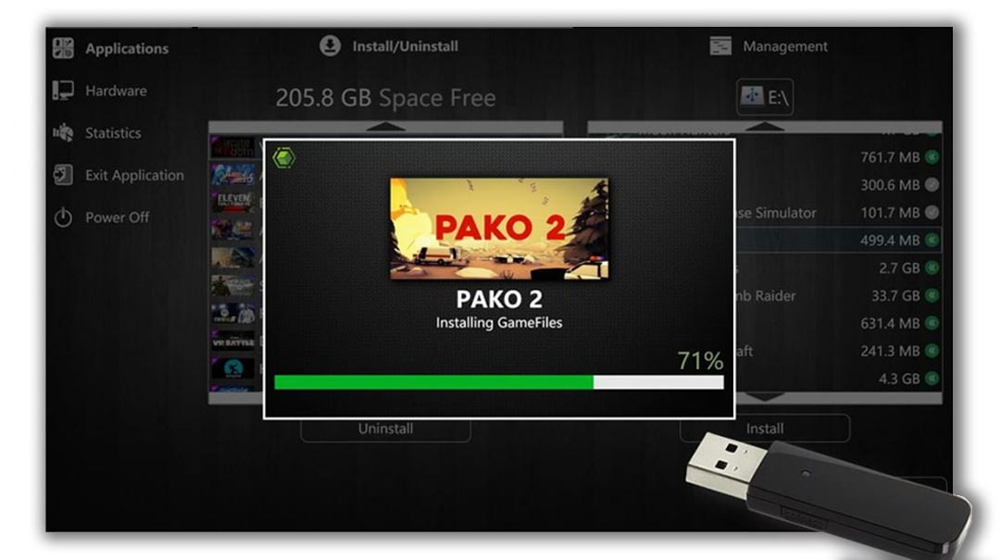

# 05 — Installing games

> Getting a `.vbox` package onto a station: USB drag-drop in the admin
> panel, with per-file progress reporting.

## What's a `.vbox`?

A `.vbox` file is a single self-describing container that holds:

1. **GameFiles** — the entire game install directory, zipped.
2. **MediaFiles** — the catalog artwork (`mainPicture.png` typically
   460×215).
3. **Metadata** — JSON sidecar with the display data
   (`displayData.json`) and the launch instructions
   (`platformData.json`), inside a small zip.

…followed by a Protobuf header and an 8-byte trailing offset pointer.

The contract between author and station is documented in
[`../content-creator/README.md`](../content-creator/README.md). The
[**Content Creator chapter**](07-content-creator.md) walks the authoring
side. This chapter is the receiving side.

## The Install / Uninstall view

Open the kiosk's admin panel ([**Chapter 04**](04-admin-panel.md)), pick
**Applications → Install/Uninstall**:

- **Left column**: games currently installed on the station, with their
  on-disk size. The disk-space banner at the top reflects the same metric
  as the donut in [**Chapter 04 / Hardware**](04-admin-panel.md).
- **Right column**: `.vbox` packages found on the selected external drive
  (here `E:\`). The dropdown above the right column lets the admin pick a
  different drive — USB stick, external HDD, mounted network share.
- **Install** — copies the selected package's content to the station's
  install root and registers it with the kiosk's catalog.
- **Uninstall** — removes a game's extracted files (and frees disk).

The size to the right of each package is what the GameFiles zip will
extract to on disk — typically 2-3× the `.vbox` file size for compressed
game assets, closer to 1× for already-compressed content like videos.

## Live install progress

When the admin hits **Install**, the kiosk overlays a progress card with
the current game's artwork and a live progress bar:

The label under the cover shows the current phase. There are typically
three:

1. **Installing GameFiles** — the largest, slowest phase. The kiosk
   extracts the GameFiles zip-package from inside the `.vbox` via
   `ZipReadablePackage.ExtractToDirectory`. As of v1.0.0 this extract
   is parallelised across CPU cores (see
   [`../content-creator/README.md`](../content-creator/README.md) →
   "Editing an existing `.vbox`" for the parallel-extract design).
2. **Installing MediaFiles** — fast; just the cover art.
3. **Installing Metadata** — fast; the JSON sidecars are written into
   the kiosk's local catalog.

The progress bar reports bytes-done / total-bytes summed across all three
phases; small games can complete the bar in seconds, multi-GB games take
proportionally longer.

If the install fails mid-stream — out of disk, USB unplugged, package
corrupt — the kiosk rolls back the partial extract and the entry is
removed from the catalog. There is no half-installed state.

## Uninstalling

Tap an installed game in the left column, hit **Uninstall**. The kiosk
asks for confirmation, then removes the extracted files and the catalog
entry. There is no recycle bin — the bytes are gone from disk
immediately. The `.vbox` source file on the USB stick is untouched, so a
reinstall is always a tap away.

## Two ways to get `.vbox` files onto a station

| Path | When |
|------|------|
| **Manual USB** | Single station, one-off install, no network or operator doesn't want to push from the back office. The flow shown above. |
| **Operator push** (planned) | Operator selects a package on the server, picks stations to push to, the server queues a download over gRPC. Designed in the architecture docs but not in v1.0.0; tracked as future work. |

For now, USB is the canonical path. The
[**Content Creator chapter**](07-content-creator.md) covers how to make a
`.vbox` from a folder of game files.

---

→ [**06 — Customization**](06-customization.md) 
→ [**07 — Content Creator**](07-content-creator.md) — how to author the
`.vbox` files this chapter installs.
