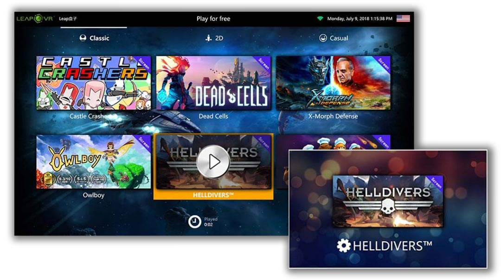

# 06 — Customization

> Skinning, languages, and the multimedia background. Per-station, no
> server round-trip required.

## Skins

The catalog UI is a regular WPF window with a ResourceDictionary-driven
theme. Drop a new skin into the kiosk's `Skins/` folder, switch to it in
the admin panel, and the entire catalog re-renders. Two of the original
LeapVR themes are bundled:

The dark default theme is shown in
[**Chapter 03**](03-game-catalog.md). The skin above replaces the wood-
panel texture with a starfield and uses a brighter accent colour, but the
layout, tile sizing, and category-tab logic are unchanged — only colours,
fonts, and background bitmap differ.

Skins ship as XAML `ResourceDictionary` files; the theming surface is
documented per project in
[`../client/`](../client/) and the in-tree examples are in the kiosk's
`Resources/Styles/` folder.

## Multimedia background

For QR-mode and Remote-mode stations, the kiosk can play a looping
playlist of audio + video as the idle background while waiting for a
player. Configured under **Multimedia** in the admin panel:

- **Auto-Play** (自动播放) — start the playlist as soon as the kiosk boots.
- **Loop** (列表循环) — restart from the top when the last entry ends.
- **Volume** — adjusts master volume.
- **Playlist** — ordered list of paths. Add files with the **Add** (添加)
  button, remove with **Remove** (移除).

Supported formats: MP3 / WAV / OGG for audio; MP4 / MKV / MOV for video.
The kiosk uses the FFME (FFmpeg-based) media element shipped under
`LeapVR.Shell.3rdParty/ffmediaelement/` for playback, which means
everything FFmpeg supports works in principle — but only the formats
listed are officially tested for the kiosk's looping playback path.

When a player logs in, the multimedia layer fades out and the catalog
takes over. When the session ends, the multimedia layer fades back in.

## Languages

PlayOnDemand ships in **English (en-US)** and **Simplified Chinese
(zh-CN)** out of the box. The kiosk and the Content Creator both have a
language toggle (see the flag radio buttons in the Content Creator's main
window, and the language toggle on the PIN-entry screen in
[**Chapter 04**](04-admin-panel.md)).

The Flutter operator app is currently English-only; localisation is
straight Flutter `intl` and any community-contributed locale slots
straight into the same ARB file structure.

## What gets synced, what stays local

| Setting | Lives at |
|---------|----------|
| Skin selection | Local — per-station |
| Multimedia playlist | Local — per-station |
| Language toggle | Local — per-station |
| Catalog content (installed games) | Local — synced metadata to server |
| Categories / category names | Server-managed, pushed via gRPC |
| Station mode (QR / Operator / Remote) | Server-managed, pushed via gRPC |
| Session quota, balance, allowed games | Server-managed; the kiosk just enforces |

The split is deliberate: anything cosmetic stays at the station so a
network outage doesn't change how the venue looks. Anything operational
lives on the server so the operator can change it centrally and have
every station agree on what's true.

---

→ [**07 — Content Creator**](07-content-creator.md) 
→ [**08 — Operator app**](08-operator-app.md)
