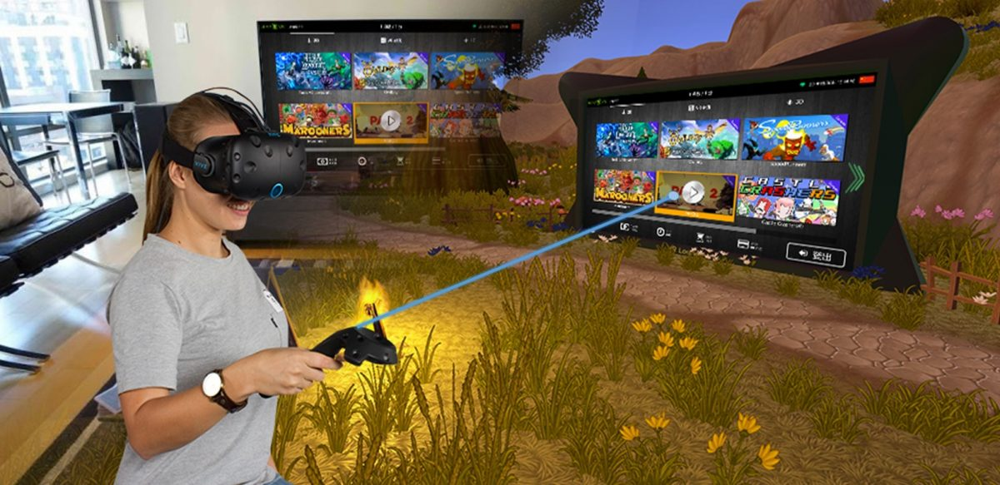

# PlayOnDemand — Illustrated Manual

> An end-user, screenshot-driven walkthrough of the platform. For engineering
> docs (architecture, gRPC, build), see
> [`docs/architecture/`](../architecture/). For the marketing front-door, see
> the top-level [`README.md`](../../README.md).

  

PlayOnDemand has four working surfaces. Each chapter below walks one of them
end-to-end with the matching production screenshots.

## Chapters

### Player-facing — what happens at the station

| | |
|--|--|
| [**01 — Overview**](01-overview.md) | What a station is, the three login modes, the three user roles. |
| [**02 — Station login modes**](02-station-modes.md) | Operator-driven, QR-code self-checkout, fully remote. |
| [**03 — Game catalog & launch**](03-game-catalog.md) | Categories, gamepad navigation, multi-launch options per app. |

### Station-admin — back-of-house, on the kiosk itself

| | |
|--|--|
| [**04 — Admin panel**](04-admin-panel.md) | PIN entry, hardware info, app library, multimedia background, statistics. |
| [**05 — Installing games**](05-installing-games.md) | USB install, the `.vbox` format, install progress. |
| [**06 — Customization**](06-customization.md) | Skins, languages, station naming. |

### Content authoring — packaging games into `.vbox` containers

| | |
|--|--|
| [**07 — Content Creator**](07-content-creator.md) | Create / Edit / Unpack flows, partial-edit for huge packages. |

### Operator-facing — running the venue from the back office

| | |
|--|--|
| [**08 — Operator app (Flutter)**](08-operator-app.md) | Web + mobile UI: stations, sessions, balances, API keys. |
| [**09 — Remote control & sessions**](09-remote-control.md) | Minting sessions, driving stations remotely, monitoring heartbeats. |

---

## Conventions used in this manual

- Screenshots are from the original LeapVR / LeapPlay production builds and
  show real games (Beat Saber, Dead Cells, Audioshield, Crawl, Eleven Table
  Tennis, etc.). The catalogue contents are illustrative — what your stations
  show is up to your operator.
- Where the UI ships in two languages, the English screenshot is used in the
  manual. The 简体中文 build is fully supported and selectable per station.
- The badges next to game tiles mean:
  - **VR** — game requires SteamVR / OpenVR; station must be in VR mode.
  - **Screen** — flat-screen game, runs without an HMD.

## Related reading

- [`../about.md`](../about.md) — the project's heritage, license, status.
- [`../architecture/session-lifecycle.md`](../architecture/session-lifecycle.md) — the
  state machine behind everything in chapters 02 / 08 / 09.
- [`../content-creator/README.md`](../content-creator/README.md) — engineering-side
  details of the `.vbox` format that chapter 07 walks through visually.
